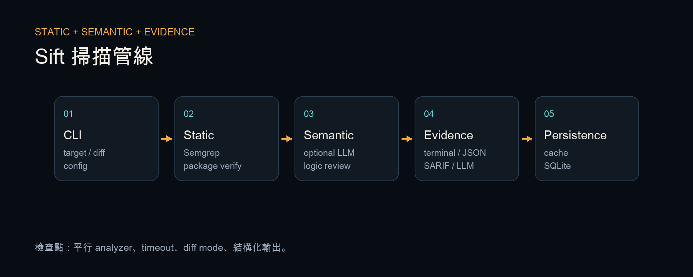
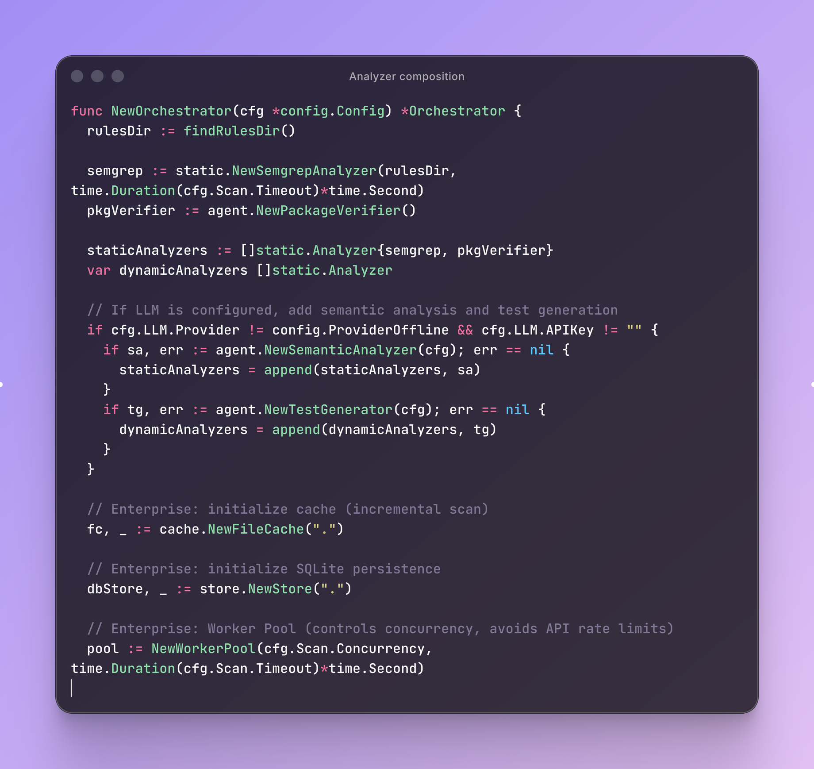
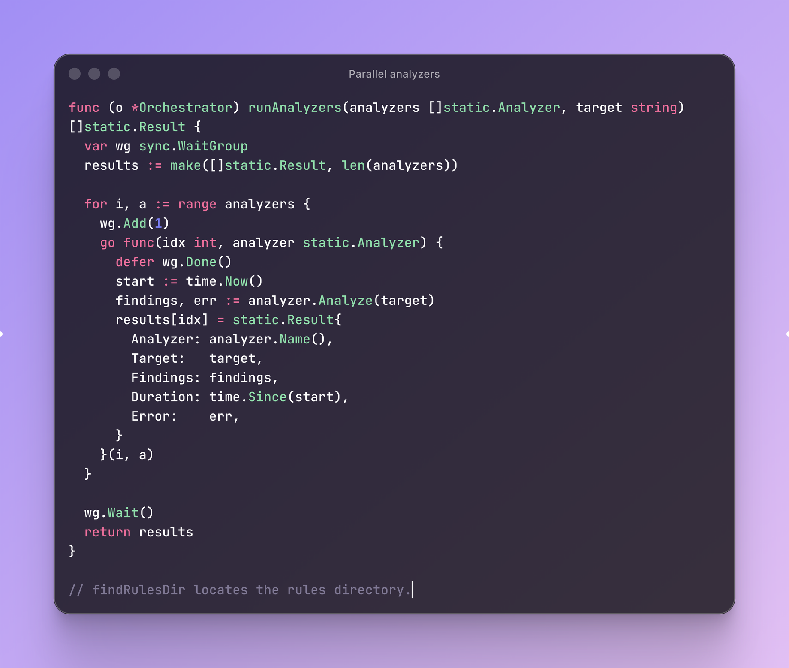

# Sift

Go CLI，用靜態規則、套件驗證與選擇性 LLM 分析檢查程式碼，並輸出 terminal、JSON、SARIF 或 LLM-readable report。

[繁體中文](./README.zh-Hant.md) · [日本語](./README.ja.md)



## 掃描流程

```text
CLI target / config / diff ref
  → Semgrep rules
  → Package verifier
  → Optional semantic analyzer
  → Concurrent orchestration
  → Terminal / JSON / SARIF / LLM report
  → SQLite scan history
```

## 主要功能

- 掃描目錄、單一檔案或 Git diff。
- 執行 Semgrep 與 dependency package verification。
- 在設定 provider 後加入 semantic analysis 與 test generation。
- 以 worker pool 控制 concurrency 與 timeout。
- 使用 SHA-256 cache 跳過未改變檔案。
- 將掃描紀錄與 findings 寫入 SQLite。

## 核心程式

| Analyzer composition | Parallel execution |
|---|---|
|  |  |

## 實作重點

### Deterministic first

已知 vulnerability class 先交給可重現的 rules。LLM analyzer 用於補充語意判斷，不取代靜態檢查。

### Offline mode

沒有 provider key 時，static scan 與 package verification 仍可執行。外部模型只在設定完成後載入。

### Output formats

Terminal 適合本機閱讀，JSON 適合 automation，SARIF 可接 GitHub Code Scanning，LLM format 可交給後續修復流程。

### Concurrent execution

Analyzer 以 goroutine 並行，結果依原始 index 回填。Worker pool 控制同時執行數量與 timeout。

## 使用方式

```bash
go build -o sift ./cmd/sift
./sift init
./sift scan .
./sift scan --diff=HEAD~1 --format sarif
```

## 驗證

```bash
go test ./...
go build ./cmd/sift
```

## 維護與路線圖

目前的強化進度、已確認的安全與隱私原則，以及下一個 PR 的驗收條件，請參閱 [Maintainer Handoff](docs/MAINTAINER_HANDOFF.md)。

## 限制

- 靜態規則與模型判斷都可能產生 false positive。
- LLM 分析需要自行提供 provider key。
- 部分 packages 尚未加入行為測試。
- 掃描結果仍需人工確認 data flow 與實際執行路徑。

## License

詳見 [LICENSE](LICENSE)。

