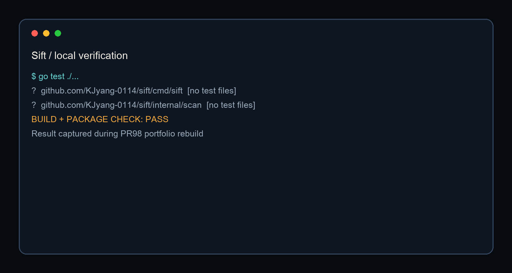

# Sift

**為了檢查 AI 快速產生的程式碼，Sift 把靜態規則、幻覺套件驗證、選擇性 LLM 分析與結構化報告整合成一個 Go CLI。**

> A Go-based scanner for reviewing AI-generated code with deterministic rules first, optional semantic analysis second, and evidence-oriented output throughout.

[English summary](#english-summary) · [繁體中文](./README.zh-Hant.md) · [日本語](./README.ja.md)


## 為誰解決什麼問題

AI 能很快寫出大量 code，也可能同時帶入 SQL injection、XSS、hardcoded secret、虛構 package 或邏輯錯誤。Sift 的目標不是宣稱「AI 會自動保證安全」，而是把檢查點固定在可執行流程中。

## 管線

1. CLI 解析 target、config 與 diff ref。
2. 以 Semgrep rules 與 package verifier 執行確定性檢查。
3. 只在使用者已配置 provider 與 API key 時，啟用 semantic analyzer / test generator。
4. analyzer 並行執行，受 concurrency 與 timeout 約束。
5. 輸出 terminal、JSON、SARIF 或 LLM-readable report，並將掃描記錄寫入 SQLite。

## 核心程式

| Analyzer composition | Parallel execution |
|---|---|
|  |  |

## 技術決策，與我學到的事

1. **確定性規則先於 LLM。** 已知 vulnerability class 交給可重現 rules，語意分析是補充，不是唯一判斷者。
2. **Offline 必須是正常模式。** 沒有 LLM key 時仍可執行 static scan 與 package verification，避免把每個檢查綁到外部服務。
3. **報告是交付介面。** Terminal 適合人、SARIF 適合 GitHub Code Scanning、JSON 適合 automation、LLM format 適合下一步修復。
4. **檢測結果不等於漏洞已確認。** Rule 與 model 都可能 false positive，最後仍需要人讀取 data flow 與實際執行路徑。

## 快速驗證

```bash
go build -o sift ./cmd/sift
./sift init
./sift scan .
./sift scan --diff=HEAD~1 --format sarif
```



PR98 重測：`go test ./...` 與 `go build ./cmd/sift` 通過。目前 packages 多為 `[no test files]`，因此這個結果只證明 compile / package integration，不代表行為覆蓋率足夠。

## 狀態與限制

- 狀態：可 build 的開源原型；22 個本人 commits。
- LLM 分析需使用者自己提供 provider key；offline 模式不需要。
- 不宣稱：找到所有漏洞、無 false positive、可取代 code review。
- 下一步：補 parser、diff mode、SARIF schema 與 cache behavior 的自動測試。

## English summary

Sift is an executable Go prototype that combines deterministic security rules, dependency verification, optional LLM analysis, concurrent orchestration, and multiple report formats. Its main lesson is methodological: AI output becomes more useful when claims are converted into checks, evidence, and repeatable reruns.
